# Enterprise-Security-Lab-FortiGate-Onion
A three-pillar (Networking, Systems, Security) lab simulating enterprise visibility and IDS alerting
# Hybrid Enterprise Lab: Visibility & Detection Engineering

## Executive Summary
This project demonstrates the integration of **Network Engineering**, **Systems Administration**, and **Cybersecurity** to build a functional "Visibility Plane." The lab simulates an enterprise branch network where all egress traffic is monitored by a Security Onion IDS.

The primary technical achievement was engineering a **Layer 2 bypass** for hypervisor-level MAC filtering, ensuring 100% packet integrity for security inspection.

---

## The Architecture

### 1. Networking (The Foundation)
*   **Gateway:** FortiOS 7.x (FortiGate NGFW) managing the internal gateway (192.168.1.1).
*   **Virtualization:** EVE-NG Professional.
*   **The Technical Fix:** Resolved a "Silent Packet Drop" issue by bridging the virtual lab directly to a physical Ethernet interface (VMnet0). This bypassed VMware’s unicast filtering, allowing the IDS to operate in true Promiscuous Mode.

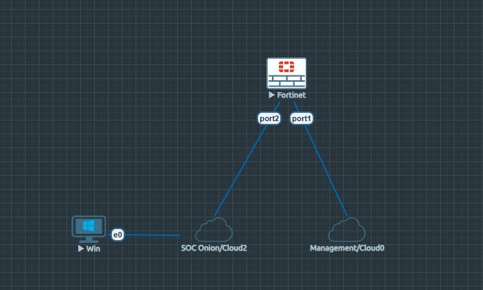
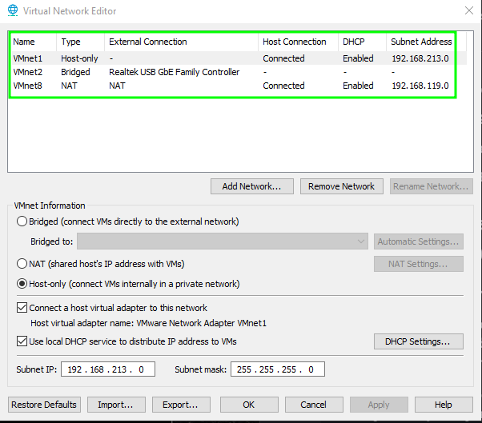
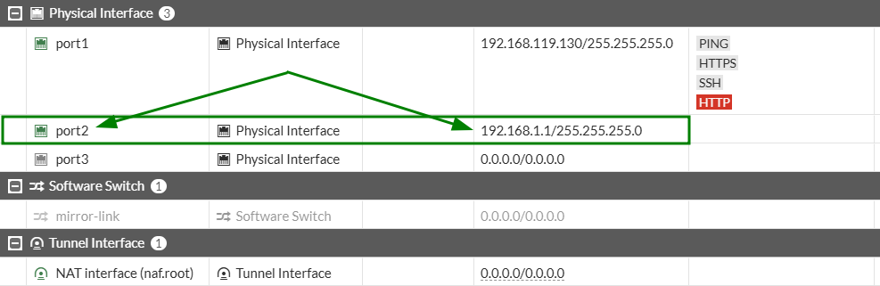

### 2. Systems Administration (The Target)
*   **Endpoint:** Windows 10 Workstation configured with a static IP (`192.168.1.10`).
*   **Connectivity:** Verified bidirectional flow and MTU alignment across the virtual-to-physical boundary.

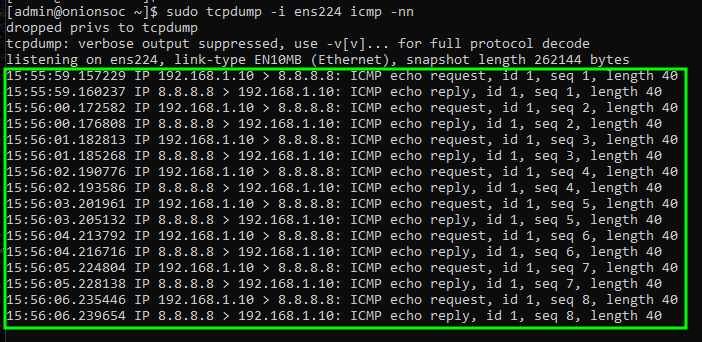
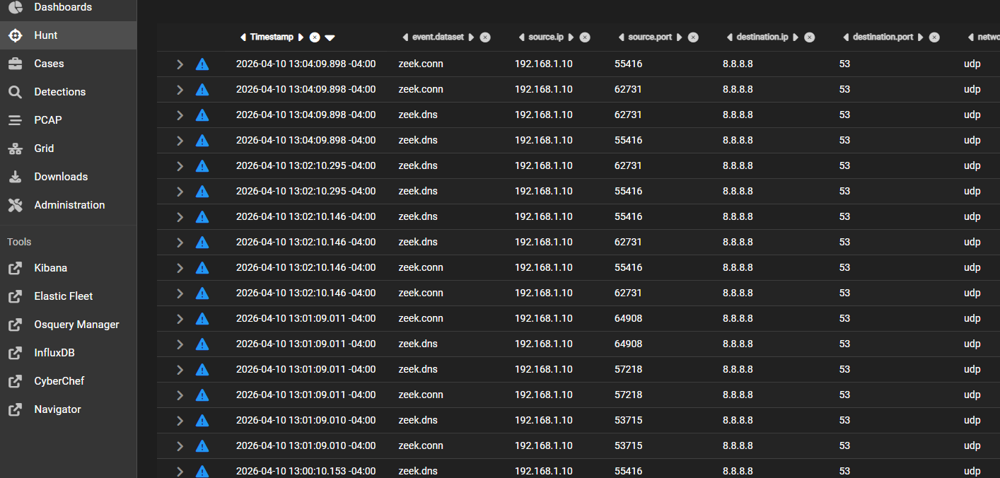

### 3. Cybersecurity (The Oversight)
*   **Sensor:** Security Onion 2.4 (Suricata/Snort engine).
*   **Validation:** Successfully triggered and logged signature-based alerts for "GPL ATTACK_RESPONSE" using simulated malicious HTTP traffic (testmyids.com).

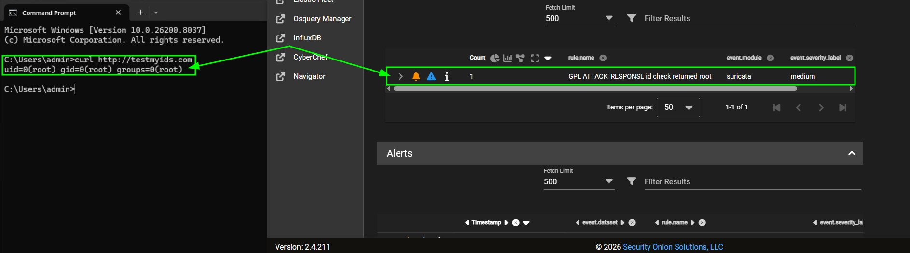

---

## Lessons Learned
*   **Hypervisor Limitations:** Learned that virtual switches often drop traffic not destined for the VM's specific MAC address, requiring a physical bridge for IDS mirroring.
*   **Data Integrity:** Discovered that trial-license software switches can alter packet headers; shifted to a "Shared Segment" architecture to preserve source-IP visibility for the SOC.

## Next Steps (Phase 2)
*   Integrate Active Directory for centralized identity management.
*   Deploy Sysmon on the Windows endpoint to correlate host logs with network alerts.

## Phase 2: Adversary Emulation & Host-Hardening

### 1. Provisioning the Forensic Baseline (GPO)
Establishing connectivity was Phase 1; Phase 2 focuses on forcing the OS to reveal malicious activity. I deployed the `SEC_Auditbaseline` GPO to ensure 100% process transparency across the enclave.

**Key Configurations:**
* **Subcategory Override:** Forced "Audit: Force audit policy subcategory settings" to Enabled. This prevents legacy policies from flattening my advanced audit settings.
* **Command-Line Transparency:** Enabled "Include command line in process creation events" (Event ID 4688) to expose encoded C2 cradles.
* **PowerShell Script Block Logging:** Configured to capture de-obfuscated code at runtime, bypassing basic Base64 evasion.

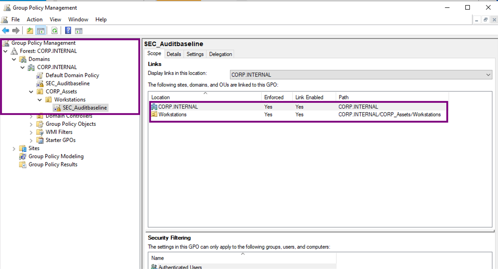
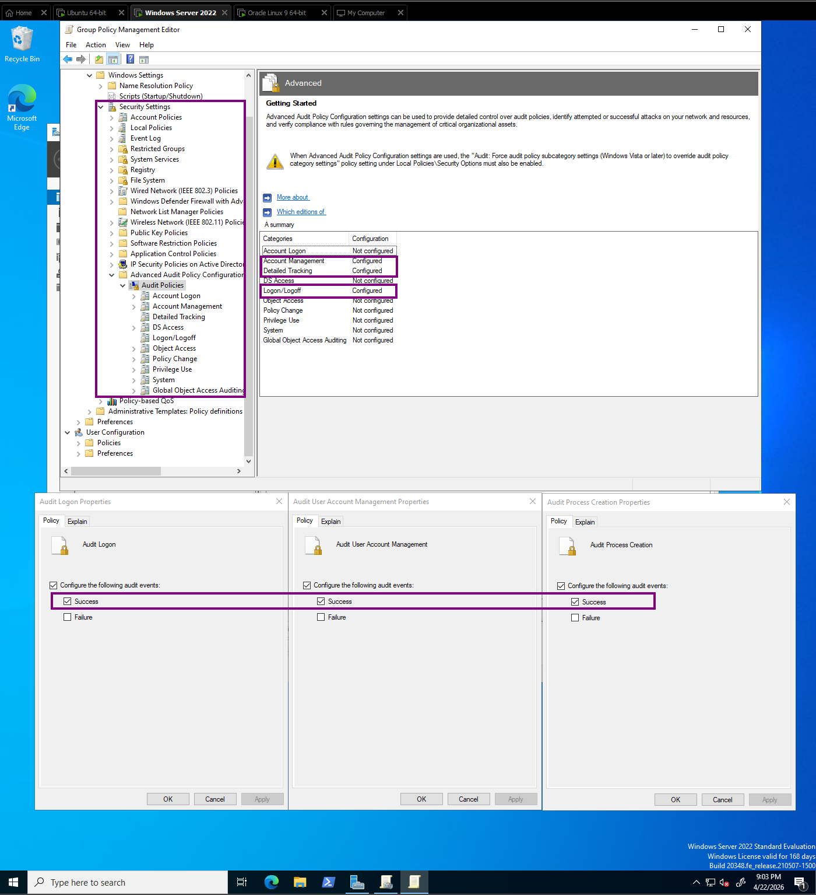
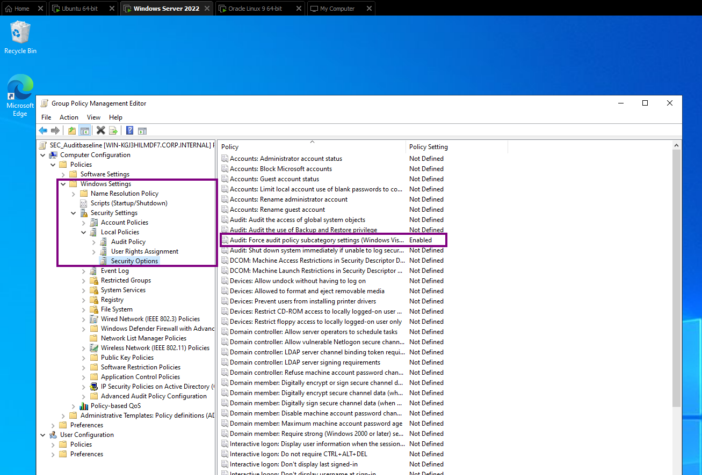
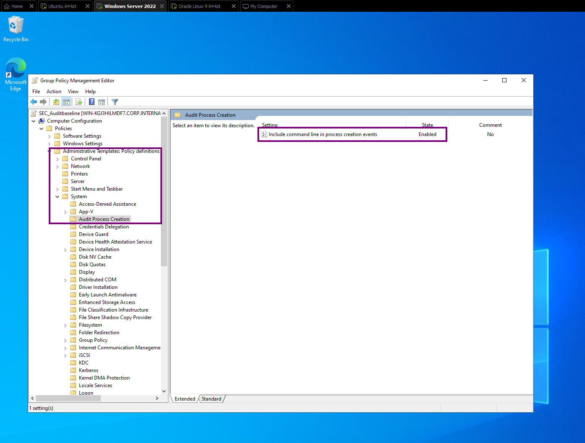

---

### 2. Validating the Pipeline: LSASS Memory Dump (T1003.001)
To test the detection logic, I emulated a "Living off the Land" (LotL) attack using an encoded PowerShell command to dump LSASS memory via `comsvcs.dll`.

**Attack String Analysis:**
I utilized CyberChef to decode the UTF-16LE/Base64 payload, revealing the hidden C2 download string. This validated that while the adversary utilized obfuscation, the host-level logging captured the cleartext intent.

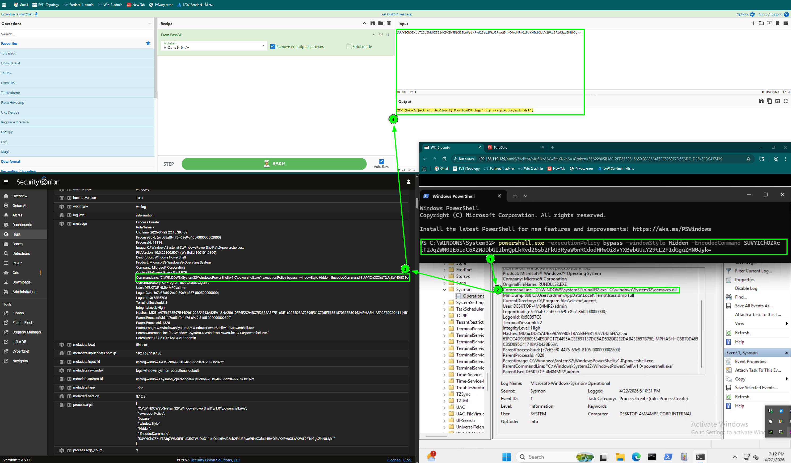
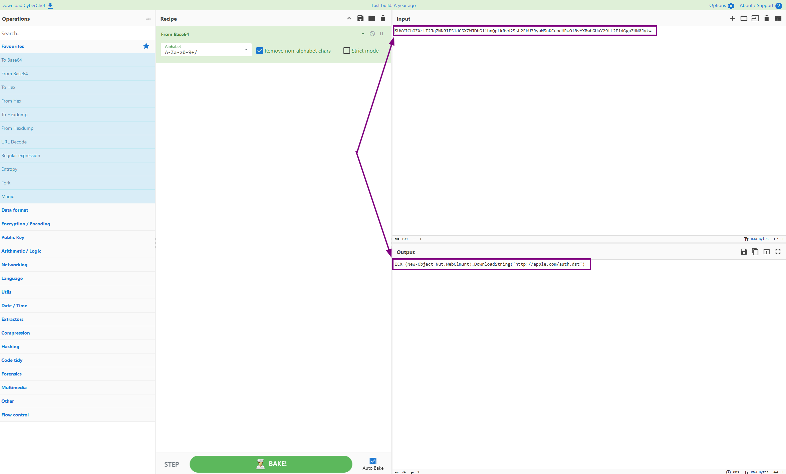
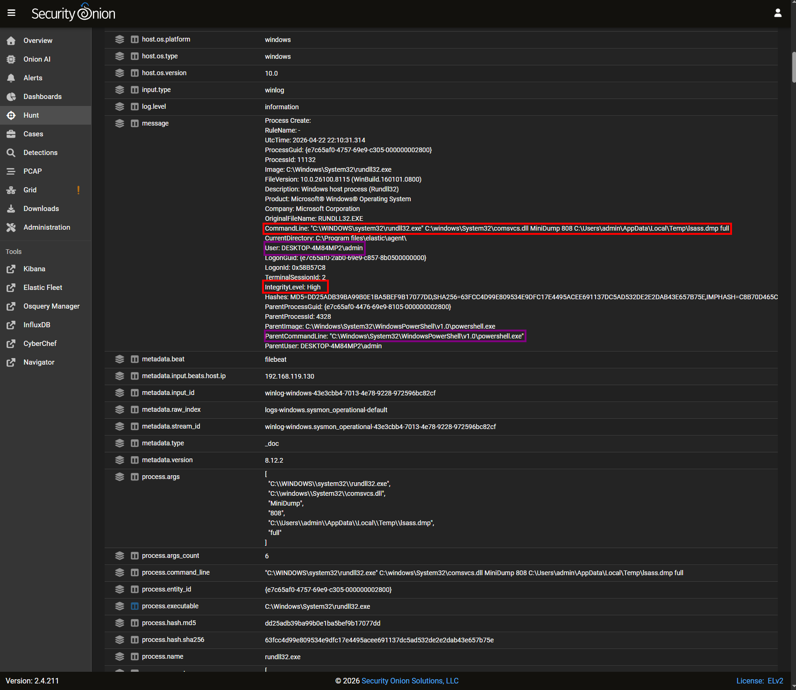
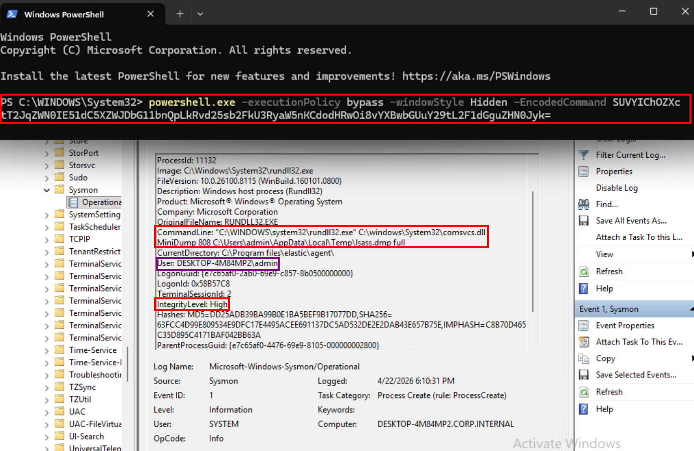

---

### 4. Lab Infrastructure (Network Architecture)
Current topology showing the isolation between the Adversary Enclave (VMnet 1) and the Management DMZ (VMnet 8).

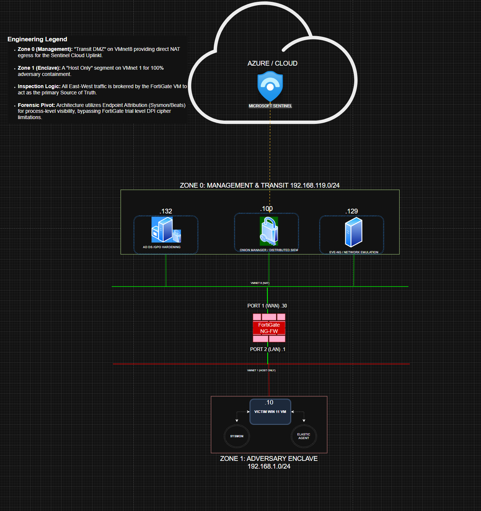

## Lessons Learned & Pivot
* **Endpoint vs. Network:** When trial-license limits restricted network-layer DPI, I pivoted to Endpoint Attribution (Sysmon/Beats). This confirmed that host-level telemetry often provides higher fidelity for encrypted "East-West" traffic than appliance-level inspection.
* **GPO "Flattening":** Discovered and resolved an Audit Subcategory Override conflict. This was a critical fix; legacy Windows policies were "flattening" my advanced audit settings and blinding the SIEM to process-creation events.
  
## Next Steps (Phase 3)
* **Cloud Uplink:** Finalize the Logstash-to-Sentinel pipeline to sync local telemetry with the Azure SecurityOnion_CL table.
* **KQL Engineering:** Transition from "Hunting" in Security Onion to building custom Kusto Query Language (KQL) workbooks in Sentinel for long-term trend analysis.

