# Enterprise-Security-Lab-FortiGate-Onion
A three-pillar (Networking, Systems, Security) lab simulating enterprise visibility and IDS alerting
# Hybrid Enterprise Lab: Visibility & Detection Engineering

## Executive Summary
This project demonstrates the integration of **Network Engineering**, **Systems Administration**, and **Cybersecurity** to build a functional "Visibility Plane." The lab simulates an enterprise branch network where all egress traffic is monitored by a Security Onion IDS.

The primary technical achievement was engineering a **Layer 2 bypass** for hypervisor-level MAC filtering, ensuring 100% packet integrity for security inspection.

---

## Architecture

### 1. Networking (The Foundation)
*   **Gateway:** FortiOS 7.x (FortiGate NGFW) managing the internal gateway (192.168.1.1).
*   **Virtualization:** EVE-NG Professional.
*   **The Technical Fix:** Resolved a "Silent Packet Drop" issue by bridging the virtual lab directly to a physical Ethernet interface (VMnet0). This bypassed VMware’s unicast filtering, allowing the IDS to operate in true Promiscuous Mode.

### 2. Systems Administration (The Target)
*   **Endpoint:** Windows 10 Workstation configured with a static IP (`192.168.1.10`).
*   **Connectivity:** Verified bidirectional flow and MTU alignment across the virtual-to-physical boundary.

### 3. Cybersecurity (The Oversight)
*   **Sensor:** Security Onion 2.4 (Suricata/Snort engine).
*   **Validation:** Successfully triggered and logged signature-based alerts for "GPL ATTACK_RESPONSE" using simulated malicious HTTP traffic (testmyids.com).

---

## Lessons Learned
*   **Hypervisor Limitations:** Learned that virtual switches often drop traffic not destined for the VM's specific MAC address, requiring a physical bridge for IDS mirroring.
*   **Data Integrity:** Discovered that trial-license software switches can alter packet headers; shifted to a "Shared Segment" architecture to preserve source-IP visibility for the SOC.

## Next Steps (Phase 2)
*   Integrate Active Directory for centralized identity management.
*   Deploy Sysmon on the Windows endpoint to correlate host logs with network alerts.

## Phase 2: Adversary Emulation & Host-Hardening

### 1. Provisioning the Forensic Baseline (GPO)
Establishing connectivity was Phase 1; Phase 2 focuses on forcing the OS to reveal malicious activity. I deployed the `SEC_Auditbaseline` GPO to ensure 100% process transparency across the enclave.

**Key Configurations:**
* **Subcategory Override:** Forced "Audit: Force audit policy subcategory settings" to Enabled. This prevents legacy policies from flattening my advanced audit settings.
* **Command-Line Transparency:** Enabled "Include command line in process creation events" (Event ID 4688) to expose encoded C2 cradles.
* **PowerShell Script Block Logging:** Configured to capture de-obfuscated code at runtime, bypassing basic Base64 evasion.

---

### 2. Validating the Pipeline: LSASS Memory Dump (T1003.001)
To test the detection logic, I emulated a "Living off the Land" (LotL) attack using an encoded PowerShell command to dump LSASS memory via `comsvcs.dll`.

**Attack String Analysis:**
I utilized CyberChef to decode the UTF-16LE/Base64 payload, revealing the hidden C2 download string. This validated that while the adversary utilized obfuscation, the host-level logging captured the cleartext intent.

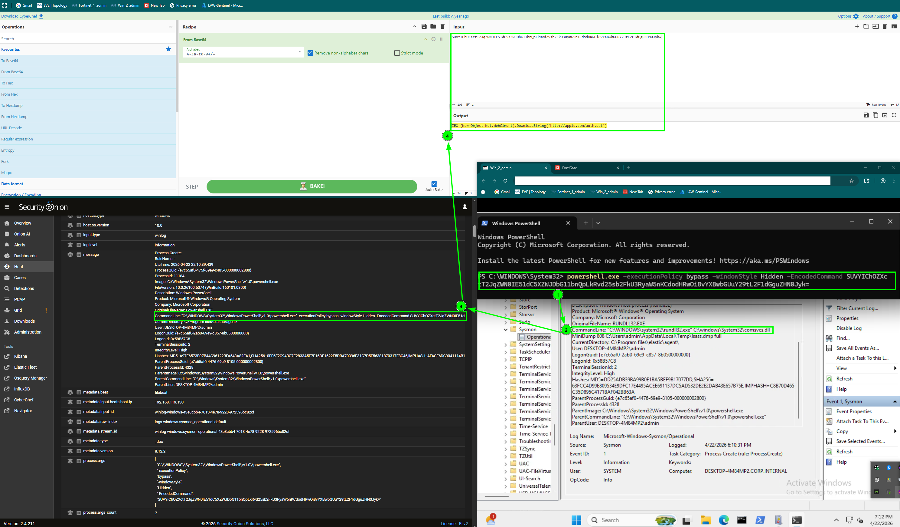

---

### 4. Lab Infrastructure (Network Architecture)
Current topology showing the isolation between the Adversary Enclave (VMnet 1) and the Management DMZ (VMnet 8).

## Lessons Learned & Pivot
* **Endpoint vs. Network:** When trial-license limits restricted network-layer DPI, I pivoted to Endpoint Attribution (Sysmon/Beats). This confirmed that host-level telemetry often provides higher fidelity for encrypted "East-West" traffic than appliance-level inspection.
* **GPO "Flattening":** Discovered and resolved an Audit Subcategory Override conflict. This was a critical fix; legacy Windows policies were "flattening" my advanced audit settings and blinding the SIEM to process-creation events.
  
## Next Steps (Phase 3)
* **Cloud Uplink:** Finalize the Logstash-to-Sentinel pipeline to sync local telemetry with the Azure SecurityOnion_CL table.
* **KQL Engineering:** Transition from "Hunting" in Security Onion to building custom Kusto Query Language (KQL) workbooks in Sentinel for long-term trend analysis.

## Architecture Pivot: Logstash to Sentinel Native AMA
* **The original plan focused on using Logstash for log forwarding. However, I pivoted to Azure Arc and the Azure Monitor Agent (AMA) for several technical reasons:
Operational Efficiency: Azure Arc allows for direct VM management from the Azure portal. This removed the need to maintain a separate Linux Logstash server, simplifying the data path from on-prem to cloud.

* **Cost & Noise Control: The AMA allows for Data Collection Rules (DCRs) and XPath filters to drop unnecessary logs at the source. This is more efficient than writing complex Logstash grok patterns and significantly reduces cloud ingestion costs.

* **Security & Identity: I shifted to Managed Identities for authentication. This "passwordless" approach is more secure and avoided the API key expirations and tenant-mismatch issues encountered with Logstash plugins.

## Phase 3: Hybrid-Cloud Uplink & SOAR Automation
.png)

* **Executive Summary
Phase 3 moves the lab from monitoring to active defense. By bridging the local EVE-NG environment to Azure Arc, I established a unified command plane. This setup enables global visibility and automated remediation (SOAR) on local hardware in under 60 seconds.

### 1. Cloud Engineering (Uplink)
* ** Azure Arc: Projected the Windows 11 VM into Azure as a managed resource. This provides cloud-native control over local infrastructure without the need for a VPN.
  
* ** Data Pipeline: Deployed the AMA and configured a Data Collection Rule.

* ** XPath Filtering: Applied custom XPath (Microsoft-Windows-Sysmon/Operational!*) to prune noise. Only high-fidelity Sysmon events are sent to the Sentinel Event table, keeping data streams clean and cost effective.

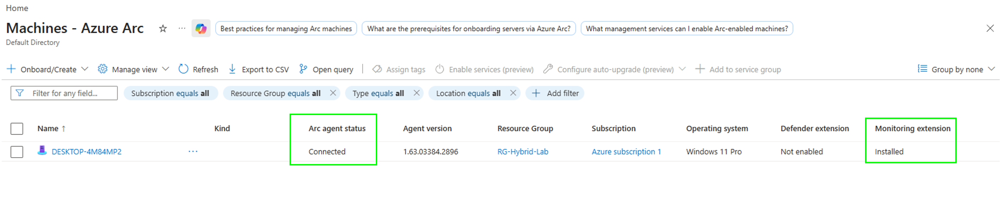
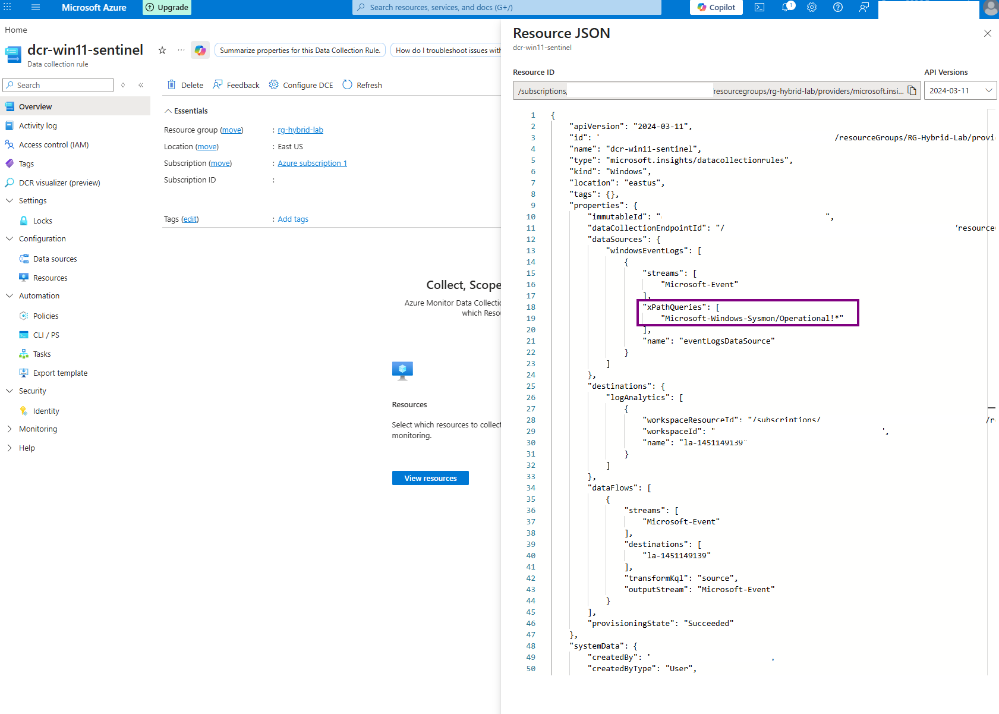
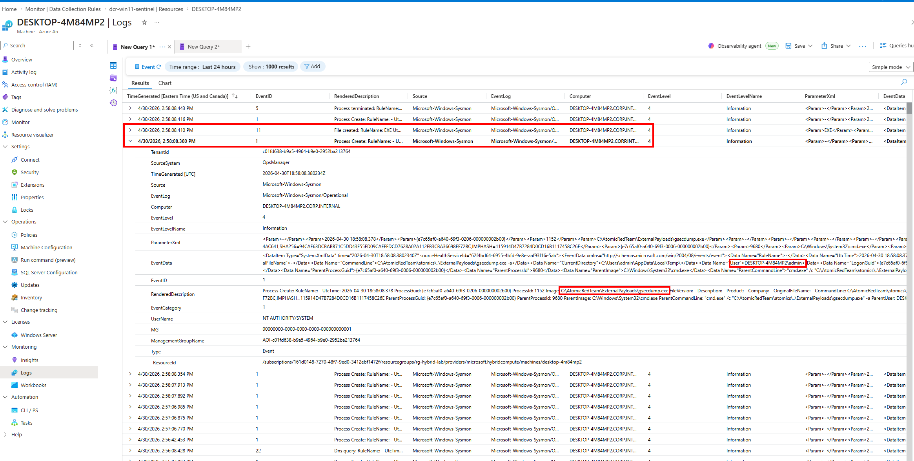

### 2. Detection Engineering (Intelligence)
* ** Adversary Emulation: Ran a T1003 Credential Dump via Atomic Red Team to generate real attack telemetry.
  
* ** KQL Logic: Built a Kusto Query Language (KQL) rule to automate alerting.
  
* ** Regex Extraction: The KQL query uses regex to pull process names and user context from raw logs, turning simple data into high-severity security incidents.

 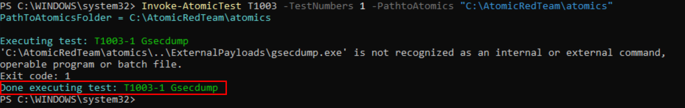
 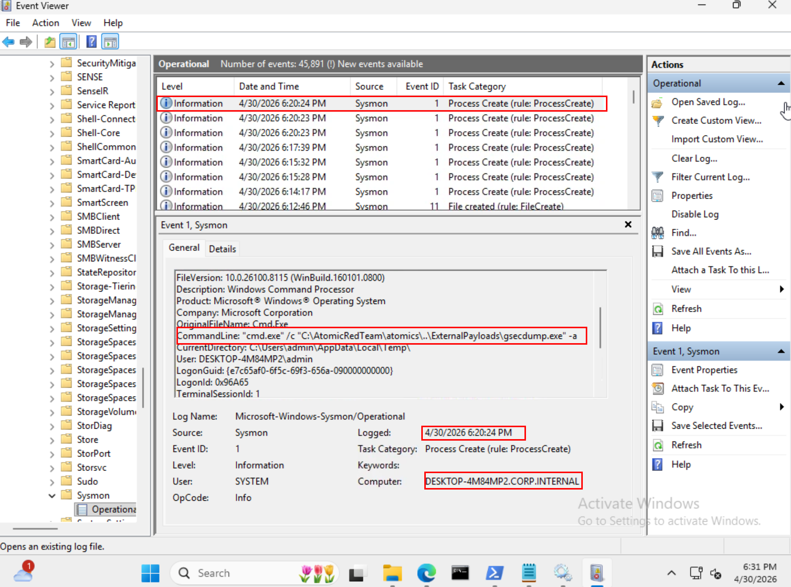
 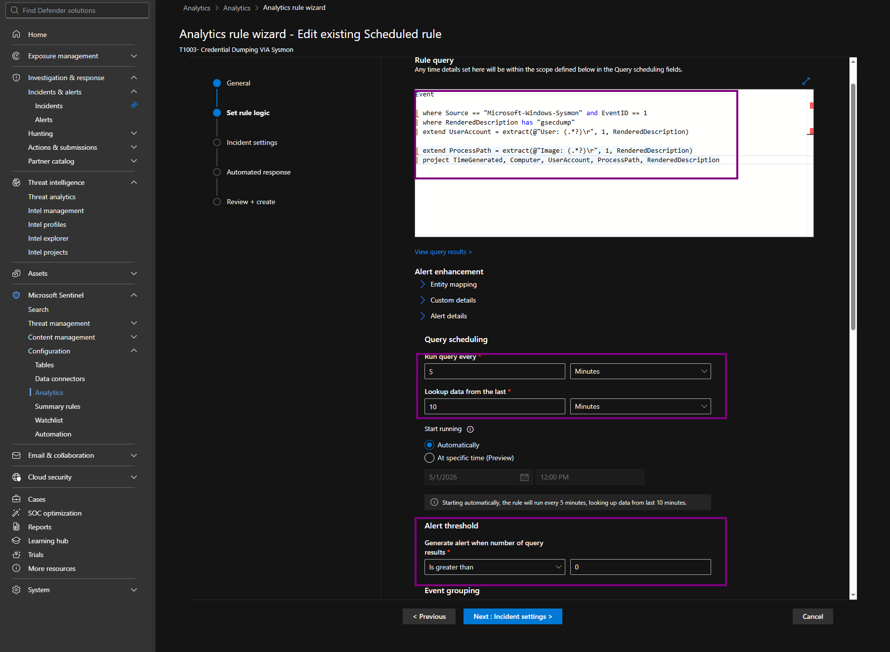
 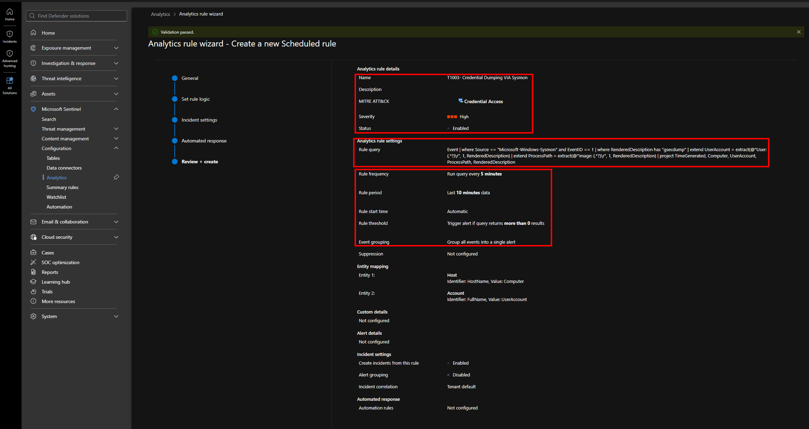
 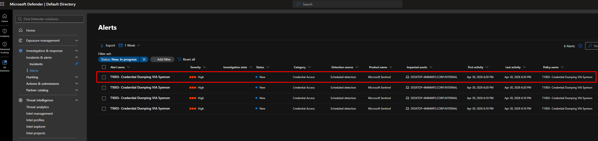

 ### 3. SOAR Orchestration (Remediation)
 * ** Response Logic: Designed a SOAR Playbook via Azure Logic Apps to close the detection-to-response loop.

 * ** Identity & RBAC: Configured a System-Assigned Managed Identity with Contributor permissions. This secures the command path between Sentinel and the Automation Account, removing the need for static credentials.

 * ** Automated Response: Linked an Azure Automation Runbook to the Logic App. For this project, I engineered a non-destructive "Kill Switch" payload that generates a critical threat notice on the endpoint's desktop. This validated the end-to-end SOAR pipeline and cloud-to-local command execution without permanently severing the Azure Arc management bridge.

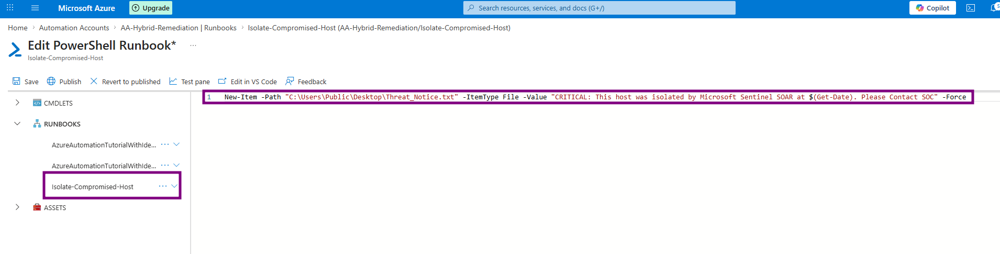
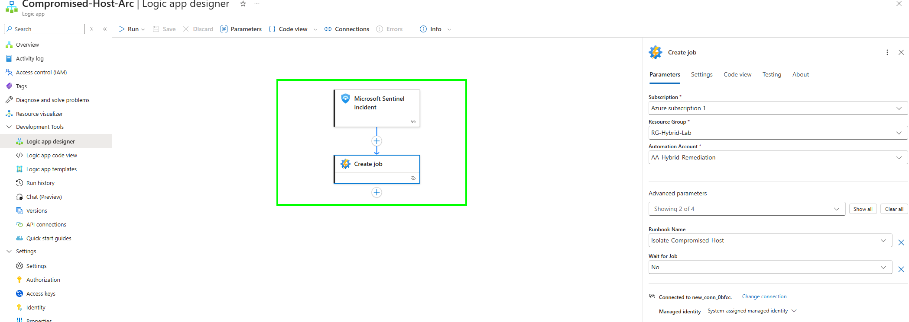
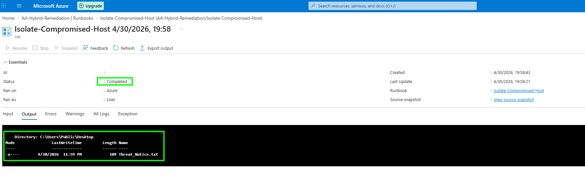

## Phase 4: Production Optimization & Automated Containment Verification

### Executive Summary
Phase 4 covers the implementation and final testing of the automated incident response system. By connecting the on-premises lab to Azure Arc, I created a fast, reliable defense pipeline. This section explains how the live automation matrix is structured, the technical logic behind the deployment choices, and how the components work together to protect the network.

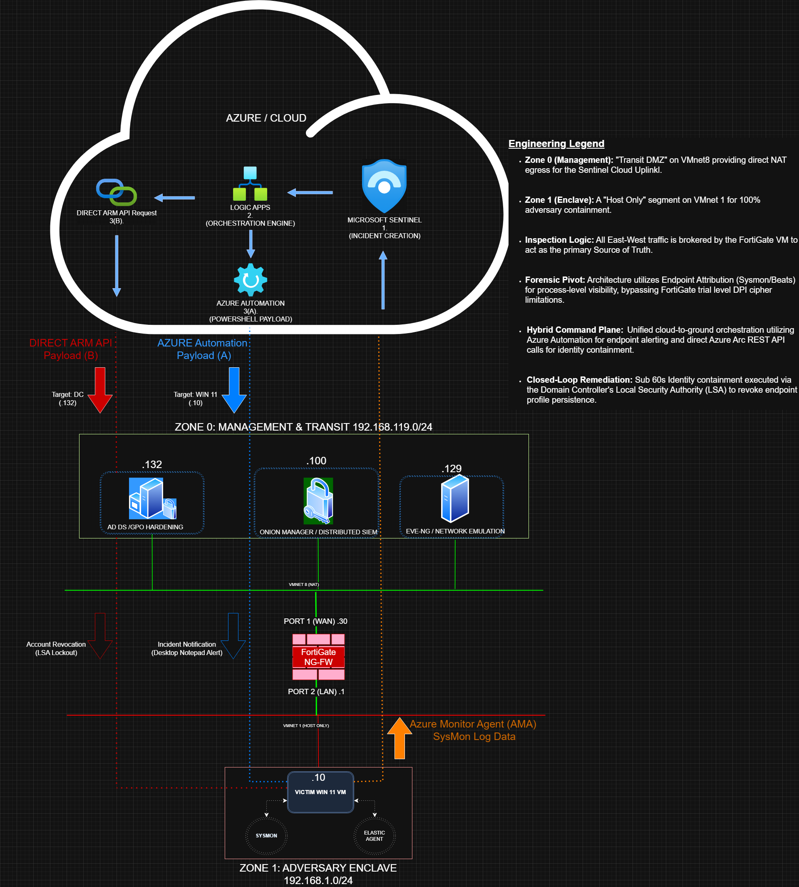

### 1. Automation Architecture & Technical Logic

#### Machine Identities for Secure Authentication (Cloud Level)
*   **Goal**: Establish a secure, automated connection between Microsoft Sentinel and the on-premises lab infrastructure.
*   **Implementation**: This was achieved by creating a dedicated corporate machine identity inside Azure named SOAR-Arc-Executor. By assigning this Service Principal identity directly to the root subscription scope, the automation playbooks can securely authenticate and execute administrative tasks without requiring manual or interactive user logins.

#### Direct Resource Management Routing (Management Level)
*   **Goal**: Ensure reliable delivery of cloud commands down to the local infrastructure without canvas saving locks or data truncation.
*   **Implementation**: This was implemented by routing playbook actions directly through the Azure Resource Manager using an explicit Short Resource ID map.

#### Native Account Containment Commands (Operating System Level)
*   **Goal**: Lock down a compromised identity instantly while maintaining lab environment stability.
*   **Implementation**: This was resolved by configuring the playbook to send a direct, native Windows command (net user SOAR-Test-Account /active:no) straight to the Domain Controller. Pushing a lightweight string directly to the Local Security Authority (LSA)  removes high-overhead script modules and avoids permission blocks tied to local system accounts, ensuring immediate containment.

---

### 2. Automated Defensive Flow (The End-to-End Execution)

When an attack occurs on the Windows 11 host, Microsoft Sentinel initiates a single automation rule that triggers two playbooks concurrently to achieve total containment:

#### Step 1: Ingestion and Coordination
Microsoft Sentinel captures the alert, generates a high-severity incident, and coordinates the simultaneous deployment of both defensive playbooks.

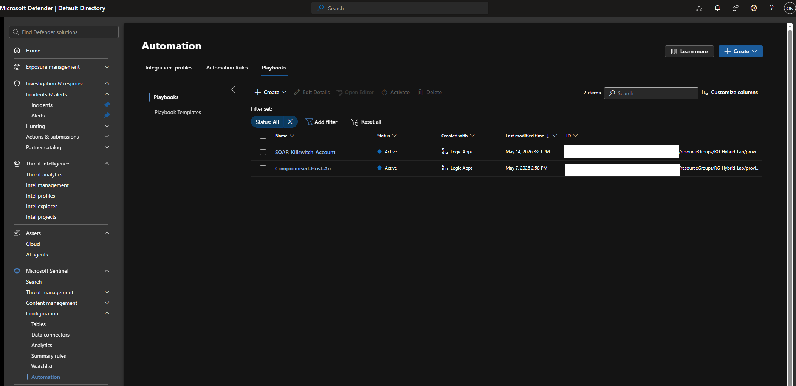
*Caption: Figure 4.1: The active inventory showing both the alert and containment playbooks ready for deployment.*

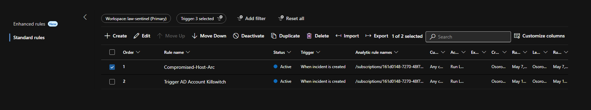
*Caption: Figure 4.2: The master automation rule configured to run both playbooks simultaneously during an active incident.*

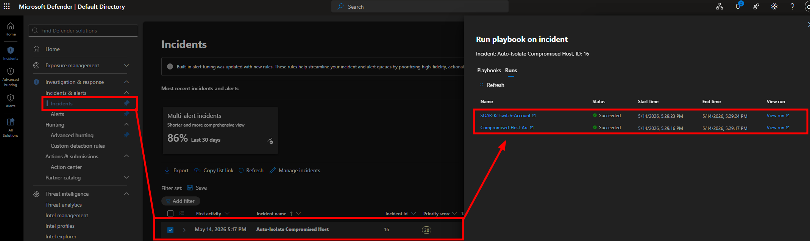
*Caption: Figure 4.3: The security dashboard tracking the successful, synchronized execution of both playbooks.*

#### Step 2: User Communication (`Compromised-Host-Arc`)
The first playbook sends a fast message down to the Windows 11 client host via an Azure Automation Runbook to visually alert the user that containment is underway.

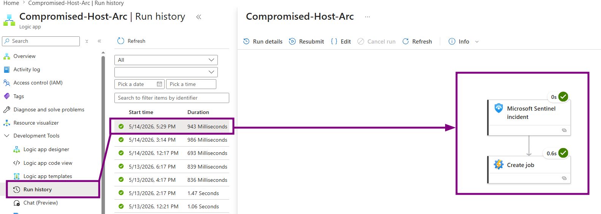
*Caption: Figure 4.4: The history log proving the alert playbook completed its deployment task in under one second.*

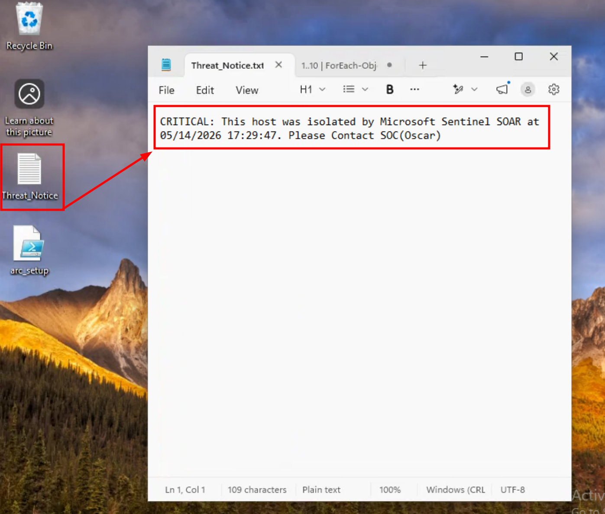
*Caption: Figure 4.5: The forensic text document that automatically appears on the user's desktop to confirm machine containment.*

#### Step 3: Identity Lockdown (`SOAR-Killswitch-Account`)
The second playbook simultaneously passes the target containment command down through Azure Arc to the Domain Controller, shutting down the compromised identity across the entire domain.

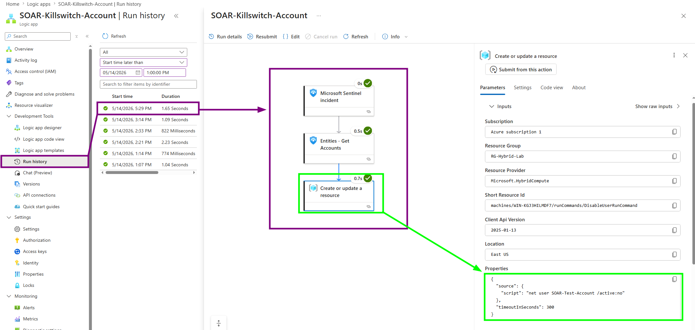
*Caption: Figure 4.6: The playbook payload configuration displaying the direct account lockdown string command.*

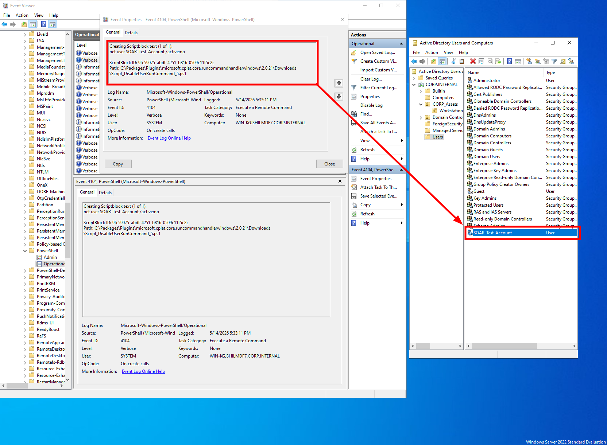
*Caption: Figure 4.7: Final verification on the Domain Controller. The local event logs record the incoming command from the cloud, and Active Directory shows the user account is completely disabled.*

---

### Project Conclusion
This project successfully proves that an on-premises company network can use modern cloud tools to build a fast, automated defense system. 

* **Fast, Automated Defense:** By connecting local servers directly to the cloud, the system drops the time to detect and stop a threat down to under 60 seconds.
* **Smart Engineering:** Solving the local account issues proved that automated security tools can stop an attacker at the identity level before they move across the network.
* **Cost and Efficiency:** Switching to direct cloud management rules removed the need for extra local servers and drastically cut down on unnecessary log noise, keeping cloud storage costs low.

Ultimately, this lab serves as a real-world blueprint for transforming a passive monitoring setup into an active, automated containment network.
